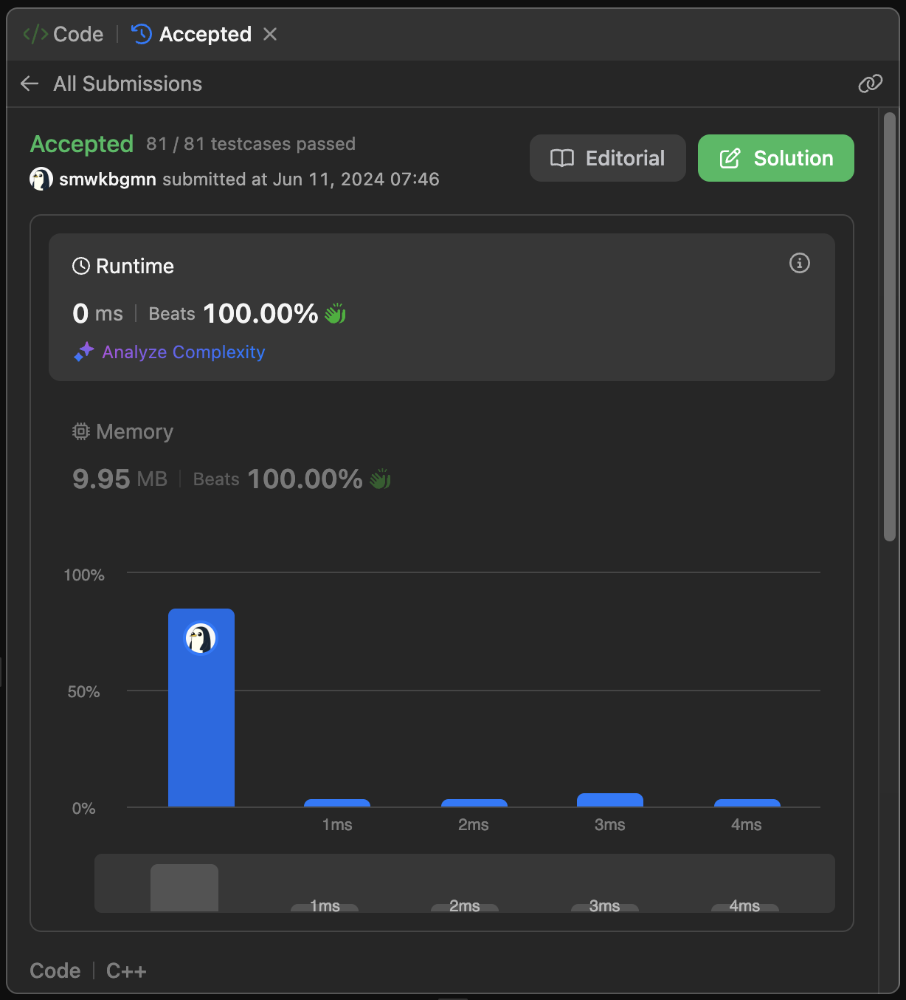

<h1 align="center">An enthusiastic problem-solver 🤔 </h1>

<h3 align="center">What I utilize to embody ideas:</h3>

   

 

 

 

 

# I'm working on
- [ADS-Skynet](https://github.com/ADS-Skynet): Autonomous Driving Agent &nbsp;
  
  
  
  
  

# Previous Works
- [DES-InstrumentCluster](https://github.com/smwkbgmn/DES_Instrument-Cluster): Embedded System with QT Framework &nbsp;
  
  
  
- [Webserv](https://github.com/smwkbgmn/webserv): Light-weight webserver satisfying the HTTP 1.1 with CGI support from scratch written in vanila C++
- [MiniRT](https://github.com/smwkbgmn/minirt): 3D space visualizer implementing ray-casting from scratch written in vanila C
  

# What I'm studying
- 42: Python for data science
- Google Developer Program: Machine Learning
- Daily LeetCode for practicing fundamental of software
  
